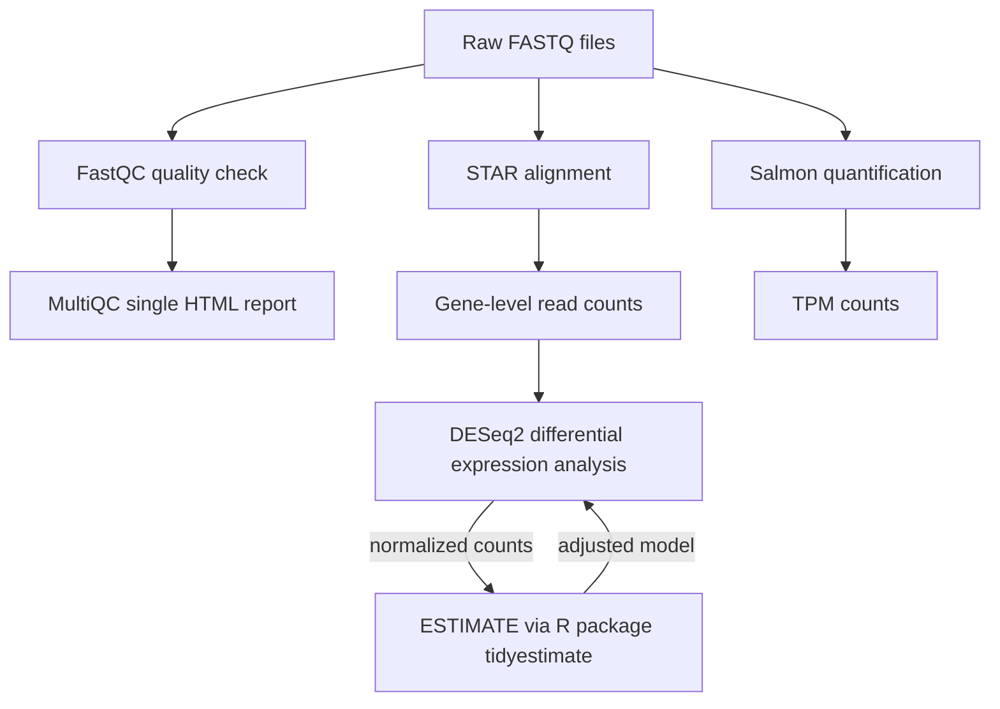

# RNAseq-Barrett's esophagus code repository
This repository contains the RNAseq data analysis pipeline used for molecular pathway and biomarker signature discovery study in Barrett's esophagus, dysplasia and EAC.
Transcriptomic profiling was carried out using bulk RNA-sequencing (paired-end short read - Illumina).

### Overview of the analysis workflow
Sequencing data alignment and read count estimations were run on a high-performance computing (HPC) system based on Linux. R based analysis was carried out in RStudio/MacOS Ventura. 

The 'hpc' and 'R' folders contain more information on how the analyses were run and template scripts used.

### Workflow

