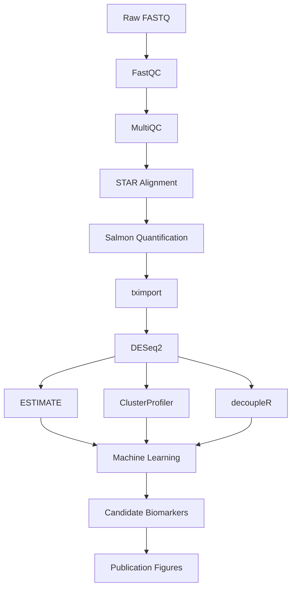

# HPC Pipeline for Bulk RNA-seq Processing

This directory contains the High Performance Computing (HPC) pipeline used to preprocess bulk RNA-seq data prior to downstream analyses in R.

The pipeline was developed for a Linux HPC environment using the SLURM workload manager.

---

## Workflow



---

## Directory Structure

```text
hpc/
├── README.md
├── config.sh
├── submit_all.sh
├── logs/
├── fastqc/
│   └── fastqc.sh
├── multiqc/
│   └── multiqc.sh
├── star/
│   ├── build_index.sh
│   └── align.sh
└── salmon/
    └── quantify.sh
```

---

## Software

The following software modules were loaded on the HPC cluster.

| Software | Version |
|----------|---------|
| FastQC | 0.12.1 |
| MultiQC | 1.18 |
| STAR | 2.7.11b |
| Salmon | 1.10.2 |

---

## Input Files

Required inputs include:

- Paired-end FASTQ files (`*.fastq.gz`)
- Reference genome (FASTA)
- Gene annotation (GTF)

Example directory:

```text
data/
└── raw_fastq/
    ├── Sample01_R1.fastq.gz
    ├── Sample01_R2.fastq.gz
    ├── Sample02_R1.fastq.gz
    └── Sample02_R2.fastq.gz
```

---

## Configuration

Project-specific paths are defined in

```text
config.sh
```

Modify only this file when moving the project to a different location.

Example variables include:

- project directory
- FASTQ location
- reference genome
- annotation file
- STAR index
- output directories
- number of CPU threads

---

## Running the Pipeline

### 1. Build the STAR genome index (run once)

```bash
cd star
sbatch build_index.sh
```

---

### 2. Run FastQC

```bash
cd fastqc
sbatch fastqc.sh
```

---

### 3. Summarise QC with MultiQC

```bash
cd multiqc
sbatch multiqc.sh
```

---

### 4. Align reads with STAR

```bash
cd star
sbatch align.sh
```

---

### 5. Quantify transcripts with Salmon

```bash
cd salmon
sbatch quantify.sh
```

---

## Expected Outputs

### FastQC

```text
results/fastqc/
```

- HTML reports
- ZIP archives

### MultiQC

```text
results/multiqc/
```

- MultiQC HTML report
- Summary statistics

### STAR

```text
results/star/
```

- Sorted BAM files
- Alignment logs
- Gene counts (if enabled)

### Salmon

```text
results/salmon/
```

One directory per sample containing:

- quant.sf
- cmd_info.json
- lib_format_counts.json
- logs

---

## Logs

SLURM output and error files are written to

```text
logs/
```

Example:

```text
logs/
├── fastqc_145820.out
├── multiqc_145821.out
├── star_145830.out
└── salmon_145840.out
```

These files are useful for troubleshooting failed jobs.

---

## Downstream Analysis

The outputs generated by this pipeline are analysed on macOS using R.

Downstream analyses include:

- tximport
- DESeq2
- ESTIMATE
- ClusterProfiler
- decoupleR
- Machine learning for biomarker prioritisation
- Publication-quality figures

Scripts for these analyses are located in the `scripts/` directory at the repository root.

---

## Notes

- All scripts are written for the SLURM scheduler.
- Reference genome and annotation should correspond to the same genome build.
- Resource requests (CPU, memory, and walltime) may require adjustment depending on dataset size and HPC policies.
- Sample names are expected to follow the convention:

```text
Sample01_R1.fastq.gz
Sample01_R2.fastq.gz
```

---