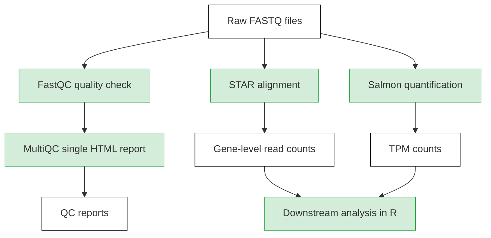

## HPC Pipeline for Bulk RNA-seq Processing

This directory contains the High Performance Computing (HPC) pipeline used to preprocess bulk RNA-seq data prior to downstream analyses in R. The pipeline was run on Linux using Slurm.


### Software

The following software modules were used for the analysis.

| Software | Version |
|----------|---------|
| FastQC | 0.12.1 |
| MultiQC | 1.13 |
| STAR | 2.7.11b |
| Salmon | 1.10.1 |


### Input files and scripts

Required inputs include:

- Paired-end FASTQ files (`*.fastq.gz`)
- Reference genome (FASTA, `GRCh38.primary_assembly.genome.fa`)
- Gene annotation (GTF, `gencode.v36.primary_assembly.annotation.gtf`)

The scripts required for the analysis are located in respective directories. 
Project-specific paths are defined in

```text
config.sh
```


### Workflow




#### (1) Quality check of raw fastq files and summary HTML report - FastQC/MultiQC
```console
fastqc -o /rnaseq/fastqc_rawreads --nogroup --dir fastqc --format -t 8 /raw_data/rnaseq/*.fastq.gz
multiqc fastqc/
```

#### (2) FASTQ read alignment and count summarization - STAR (parameters defined in Genomic Data Commons mRNA Analysis Pipeline)
```console
# STAR Genome Index
STAR --runMode genomeGenerate --genomeDir /rnaseq/reference/index \
--genomeFastaFiles /rnaseq/reference/GRCh38.primary_assembly.genome.fa \
--sjdbOverhang 100 --sjdbGTFfile /rnaseq/reference/gencode.v36.primary_assembly.annotation.gtf \
--runThreadN 8

module load star
# STAR Alignment
# STAR v2
for i in /rnaseq/*_R1.fastq.gz;
  do name=$(basename ${i} _R1.fastq.gz); 
    STAR --readFilesIn /rnaseq/${name}_R1.fastq.gz /rnaseq/${name}_R2.fastq.gz \
    --genomeDir /rnaseq/reference/index --readFilesCommand zcat --outFileNamePrefix ${name}-untrimmed --runThreadN 16 --twopassMode Basic \
    --outFilterMultimapNmax 20 --alignSJoverhangMin 8 --alignSJDBoverhangMin 1 --outFilterMismatchNmax 999 --outFilterMismatchNoverLmax 0.1 \
    --alignIntronMin 20 --alignIntronMax 1000000 --alignMatesGapMax 1000000 --outFilterType BySJout --outFilterScoreMinOverLread 0.33 \
    --outFilterMatchNminOverLread 0.33 --limitSjdbInsertNsj 1200000 --outSAMstrandField intronMotif --outFilterIntronMotifs None \
    --alignSoftClipAtReferenceEnds Yes --quantMode TranscriptomeSAM GeneCounts --outSAMtype BAM Unsorted --outSAMunmapped Within \
    --genomeLoad NoSharedMemory --chimSegmentMin 15 --chimJunctionOverhangMin 15 --chimOutType Junctions SeparateSAMold WithinBAM SoftClip \
    --chimOutJunctionFormat 1 --chimMainSegmentMultNmax 1 --outSAMattributes NH HI AS nM NM ch;
  done
```

#### (3) Transcripts Per Million (TPM) counts via Salmon
```console
for i in /naseq/*_R1.fastq.gz;
  do name=$(basename ${i} _R1.fastq.gz); 
    salmon quant -i /rnaseq/reference/salmon/salmon_transcript_index -l A -1 /rnaseq/${name}_R1.fastq.gz -2 /rnaseq/${name}_R2.fastq.gz \
    -p 16 --validateMappings -g /rnaseq/reference/salmon/geneid_list -o /rnaseq/outputs/salmon/salmon_counts/${name}_quant;
  done
```


