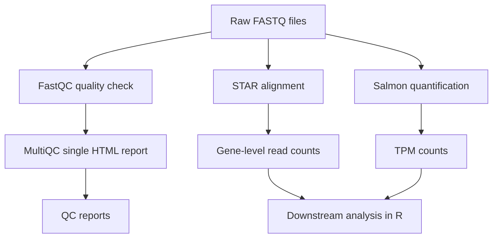

## HPC Pipeline for Bulk RNA-seq Processing

This directory contains the High Performance Computing (HPC) pipeline used to preprocess bulk RNA-seq data prior to downstream analyses in R. The pipeline was run on Linux using Slurm.


### Software

The following software modules were used for the analysis.

| Software | Version |
|----------|---------|
| FastQC | 0.12.1 |
| MultiQC | 1.13 |
| STAR | 2.7.11b |
| Salmon | 1.10.1 |


### Input files and scripts

Required inputs include:

- Paired-end FASTQ files (`*.fastq.gz`)
- Reference genome (FASTA, GRCh38.primary_assembly.genome.fa)
- Gene annotation (GTF, gencode.v36.primary_assembly.annotation.gtf)

The scripts required for the analysis are located in respective directories. 
Project-specific paths are defined in

```text
config.sh
```


### Workflow




